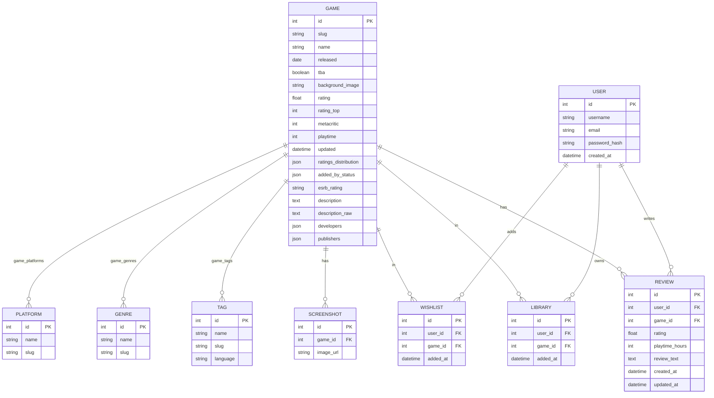

# WastedHours

## Membros do Grupo e Papéis
*	**Membro 1**: Pedro Henrique Moreira Guimarães Cortez - Fullstack
*	**Membro 2**: Caio Henrique de Miranda Onofre - Fullstack
*	**Membro 3**: Caio César Moraes Costa - Fullstack
*	**Membro 4**: Lucas de Oliveira Ferreira - Fullstack

## Objetivo do Sistema
O WastedHours é uma plataforma web voltada para a curadoria, catalogação e avaliação de jogos eletrônicos. Embora adote o tempo de jogo como tema, o objetivo central do sistema é fornecer um ecossistema completo de avaliações guiado por múltiplas métricas de engajamento e satisfação. Usuários podem registrar seu progresso, catalogar títulos, atribuir notas, escrever análises e visualizar rankings baseados na recepção geral da comunidade. A plataforma busca resolver o problema de encontrar recomendações legítimas através de avaliações reais e multifacetadas.

## Tecnologias
*	**Linguagem**: Python
*	**Framework Backend**: Flask
* 	**Banco de Dados**: SQLite (local development)
* 	**Linguagem Frontend**: JavaScript / React
* 	**Frontend Build**: Vite
* 	**Agentes de IA**: Copilot (Gemini/GPT) e Claude Code (Haiku/Sonnet)

## Como executar localmente
### Backend
1. Abra um terminal em `backend`
2. Use um ambiente virtual Python (recomendado)
     ```cmd
     python -m venv venv
     ```
     ```cmd
     venv\Scripts\Activate # Windows
     source venv/bin/activate # Linux/Mac
     ```
3. Instale as dependências:
   ```cmd
   pip install -r requirements.txt
   ```
4. Execute o backend:
   ```cmd
   python app.py
   ```
5. A API estará disponível em `http://127.0.0.1:5000`
(sujeito a alteração, confira a saída do terminal)

### Frontend
1. Abra um terminal em `frontend`
2. Instale dependências npm:
   ```cmd
   npm install
   ```
3. Execute o frontend:
   ```cmd
   npm run dev
   ```
4. O site será servido por padrão em `http://localhost:5173`
(sujeito a alteração, confira a saída do terminal)

> Observação: o backend usa um banco de dados SQLite local (`backend/games.db`) para acesso aos dados.

## Estrutura do Backend

```
backend/
├── app.py              # App factory: configura Flask, registra blueprints
├── models.py           # Modelos SQLAlchemy (Game, User, Wishlist, Library, Review, ...)
├── routes/             # Blueprints por domínio — cada arquivo = um grupo de endpoints
│   ├── games.py        # GET/POST/PUT/DELETE /api/games, /api/genres, /api/status
│   ├── auth.py         # /api/auth/register, /api/auth/login, /api/auth/me
│   ├── wishlist.py     # /api/wishlist
│   ├── library.py      # /api/library
│   └── reviews.py      # /api/reviews, /api/reviews/<id>/user-review
├── utils/              # Funções auxiliares reutilizadas entre rotas
│   ├── auth.py         # generate_token, get_authenticated_user, login_required
│   └── helpers.py      # wasted_score, parse_date, apply_game_data, ...
└── scripts/            # Scripts avulsos de manutenção
    ├── populate_db.py          # Busca jogos da RAWG API e popula o banco
    ├── migrate_and_update.py   # Altera schema e atualiza detalhes dos jogos
    ├── migrate_reviews.py      # Migração: cria tabela de reviews
    └── migrate_wishlist.py     # Migração: cria tabelas de usuário e wishlist
```

Os scripts de manutenção são executados como módulos a partir de dentro de `backend/`:

```cmd
python -m scripts.populate_db
python -m scripts.migrate_and_update
```

# Estrutura do Frontend
# TODO

```
frontend/
```

## Histórias de Usuário
1.	Como jogador, quero criar uma conta para manter um histórico pessoal dos jogos que possuo.
2.	Como usuário, quero buscar jogos pelo título para verificar as avaliações e diversas métricas de engajamento da comunidade.
3.	Como jogador, quero registrar as minhas métricas (quantidade de horas jogadas, minha avaliação (nota)) em um título específico para atualizar meu perfil.
4.	Como colecionador, quero adicionar jogos a uma "Lista de Desejos" para planejar futuras aquisições.
5.	Como usuário, quero visualizar rankings globais de jogos baseados nas melhores avaliações e métricas de popularidade para descobrir novos títulos.
6.	Como crítico, quero escrever análises detalhadas sobre minha experiência com um jogo para compartilhar minha opinião.
7.	Como usuário, quero filtrar jogos por gênero para encontrar novos títulos dentro do meu interesse.
8.	Como usuário, quero buscar jogos mais curtos para seções rápidas.

# Diagramas
### Relação de Entidades no Sistema

